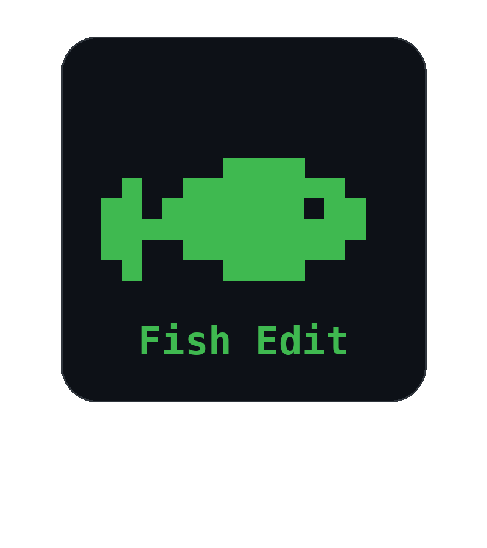

<div align="center">

# 🐟 FishEdit

**A lightweight, keyboard-driven terminal text editor for Windows, written in pure C.**

[](https://en.wikipedia.org/wiki/C_(programming_language))
[](https://www.microsoft.com/windows)
[](LICENSE)
[](#)
[](#-contributing)

</div>

<div align="center">
  
</div>

---

## 📖 About

**FishEdit** is a minimalist, fast, and dependency-free text editor that runs directly in the Windows Console. It's built entirely on top of the native **Windows Console API** (`WriteConsoleOutputA`, `CHAR_INFO` screen buffers, raw input mode) with no external libraries — just plain **C**.

It was built as a personal project to explore low-level text buffer management, undo/redo systems, and direct console rendering, resulting in a small, snappy editor that starts instantly and gets out of your way.

## ✨ Features

- 📝 **Full text editing** — insert, delete, and navigate through multi-line text with a dynamic row/column buffer.
- ↩️ **Undo / Redo** — snapshot-based undo history (up to 200 states) with smart action grouping (consecutive inserts/deletes are grouped into a single undo step).
- 💾 **File I/O** — open a file directly from the command line or save to a new file, with automatic `.txt` extension handling.
- 🔢 **Line numbers** — always-visible gutter showing the current line number.
- 📊 **Status bar** — live cursor position, total line count, and contextual messages (e.g. `Saved`, `Undo`, `No redo`).
- 🖱️ **Smooth scrolling** — both vertical and horizontal viewport scrolling for long lines and large files.
- ⌨️ **Keyboard-first navigation** — arrow keys, `Home`/`End`, `Page Up`/`Page Down`, and `Tab` (expanded to spaces).
- ⚠️ **Unsaved changes protection** — confirmation prompt before quitting with unsaved edits.
- 🪶 **Zero dependencies** — pure C using only the Win32 API, no third-party libraries required.

## 🎹 Keybindings

| Key                  | Action                          |
|----------------------|----------------------------------|
| `Ctrl + S`           | Save file (prompts for a name if none is set) |
| `Ctrl + Z`           | Undo                             |
| `Ctrl + Y`           | Redo                             |
| `Ctrl + X`           | Quit (asks for confirmation if there are unsaved changes) |
| `Arrow Keys`         | Move the cursor                 |
| `Home` / `End`       | Jump to the start / end of the line |
| `Page Up` / `Page Down` | Scroll a full page up / down |
| `Tab`                | Insert 4 spaces                 |
| `Backspace` / `Delete` | Delete the previous / next character |
| `Enter`              | Insert a new line                |

## 🚀 Getting Started

### Prerequisites

- Windows OS
- A C compiler:
  - [MinGW-w64](https://www.mingw-w64.org/) (`gcc`), **or**
  - Microsoft Visual C++ Build Tools (`cl`)

### Build

**Using MinGW (gcc):**

```bash
gcc fishedit.c -o fishedit.exe
```

**Using MSVC (Developer Command Prompt):**

```bash
cl fishedit.c /Fe:fishedit.exe
```

### Run

Open a new, empty file:

```bash
fishedit.exe
```

Open an existing file (or create it if it doesn't exist yet):

```bash
fishedit.exe notes.txt
```

> 💡 If the filename doesn't end in `.txt`, FishEdit automatically appends the extension for you.

## 🗂️ Project Structure

```
FishEdit/
├── fishedit.c        # Main source file (editor logic, buffer, rendering, input)
├── images/
│   └── screenshot.png
└── README.md
```

## 🧠 How It Works

FishEdit keeps the document in memory as a dynamic array of `Row` structures, each holding a growable character buffer. Every edit (insert or delete) is tracked by an **action-run system**: consecutive edits of the same type are treated as a single logical change, and a full-buffer snapshot is pushed onto the undo stack only when the action type changes — keeping undo/redo both simple and efficient for a small-to-medium sized editor.

Rendering is done through the Windows Console **screen buffer API**: the entire visible area (text, line numbers, title bar, and status bar) is composed into an off-screen `CHAR_INFO` grid and flushed to the console in a single `WriteConsoleOutputA` call per frame, avoiding flicker.

## 🤝 Contributing

Contributions, bug reports, and feature suggestions are welcome!

1. Fork the repository
2. Create your feature branch (`git checkout -b feature/amazing-feature`)
3. Commit your changes (`git commit -m 'Add some amazing feature'`)
4. Push to the branch (`git push origin feature/amazing-feature`)
5. Open a Pull Request

## 📄 License

This project is licensed under the **MIT License** — see the [LICENSE](LICENSE) file for details.

## 👤 Author

**Adem Mzoughi**
Software Developer


